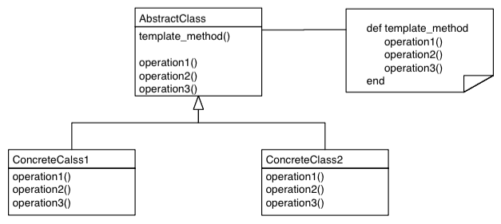

# Template Method Pattern

### Use

Template Method pattern can be used to tackle the following problem: Imagine a
complex piece of code - an algorithm or hairy system code - and somewhere in the
middle of this code there is a bit that needs to vary, sometimes this piece of
code does one thing and sometimes it does another.

### Scenario

Assuming a system that generates monthly reports in various formats, for example
HTML and plain text. To achieve that, a good idea is to set the generic steps
of this process first:

1. Output any header information required for the specific format.

2. Output the title

3. Output each line of the actual report

4. Output any trailing stuff required by the format

With this sequence on mind a good design choice could be based on abstraction.
By defining an abstract base class that encapsulates a master method which
performs the basic steps listed above and leaves the details of each step for the
concrete classes. This method is called **Template Method**

*Note:* In Ruby there are no abstract classes or methods. To simulate abstraction
raise an exception as body of a method:

```ruby
def output_line
    raise 'Called abstract method: output_line'
end
```
### Implementation

The implementation of a program such as this can be very complicated. However, the
point of this tutorial is to explain the theory that needs to be applied in
situations like the one described above.

By reading the code that is provided, it is very easy to understand the functionality
of the system. Nevertheless, some methods of the super class have been commented
as **Hook Method**. A Hook method is a non-abstract method which belongs to the
Template Method and can be overriden in the concrete class. Hook methods permit
the subclass to choose:

* To override the base implementation and do something different.

* Simply accept the base implementation.

*Note:* Usually the default implementation of a hook method is empty.

#### UML Diagram


### Drawbacks

The design is based on inheritance that produces two very important drawbacks:

1. The subclasses of the system are tangled up to the parent class, it is the
nature of the relationship.

2. Inheritance based techniques limit the runtime flexibility. In this
example, if a particular format of the report is selected, it is difficult to
change it. In order to switch to a different format it is necessary to
instantiate a new object.
